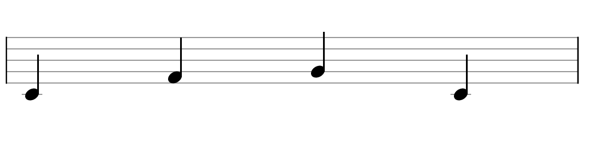

# schubert

[![CircleCI][build-badge]][build]
[![npm package][npm-badge]][npm]

musical notation components built on top of [vexflow](https://github.com/0xfe/vexflow).

**this library is under active development. things will change.**

[build-badge]: https://circleci.com/gh/khisakuni/schubert/tree/master.svg?style=svg
[build]: https://circleci.com/gh/khisakuni/schubert

[npm-badge]: https://img.shields.io/npm/v/npm-package.png?style=flat-square
[npm]: https://www.npmjs.org/package/npm-package

## install
```
yarn add schubert
```

## basic usage
more docs are coming, but in the meantime here's a basic example.
```javascript
<score>
    <sheet>
        <staff>
            <measure>
                <voice>
                    <note value="c/4" duration="q" />
                    <note value="f/4" duration="q" />
                    <note value="g/4" duration="q" />
                    <note value="c/4" duration="q" />
                </voice>
            </measure>
        </staff>
    </sheet>
</score>
```

this will render something like this:

